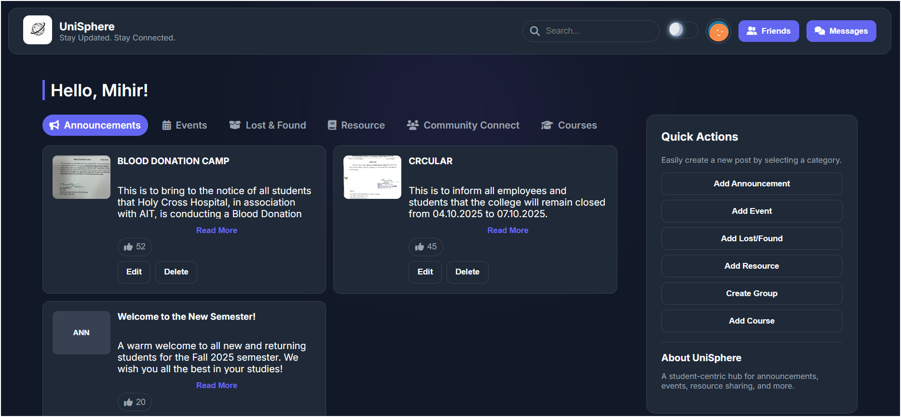

# UniSphere: Your University's Digital Campus Hub

**UniSphere is a modern, feature-rich web application designed to connect students and faculty, making university life more organized, engaging, and collaborative.**



## ✨ Core Features

This project was built from the ground up to provide a comprehensive digital ecosystem for students. The key features include:

* **Announcements & Events:** A central place for official college announcements and upcoming events, with special posting privileges for administrators.
* **Lost & Found:** A dedicated, filterable section for students to post about lost or found items, helping reunite owners with their belongings.
* **Resource Sharing:** A collaborative space for students to upload and share lecture notes, textbooks, and project code, neatly organized and filterable by category. Users can also attach downloadable files (like PDFs and ZIPs) to their posts.
* **Real-time Messaging:** A built-in, private chat system that allows students to connect and communicate with their friends instantly.
* **Friends & Community:** A complete social system where students can send, receive, and manage friend requests to build their campus network.
* **User Profiles:** Secure, customizable user profiles with the ability to upload a custom avatar or generate a modern, stylized one.
* **Role-Based Access Control:** A clear distinction between 'Admin' and 'Student' roles, ensuring that official posts can only be made by authorized staff.
* **Modern UI/UX:** A clean, responsive interface with a light/dark mode theme that is consistent across all pages of the application.
* **Intelligent Recommendations:** An AI-powered feature that suggests related posts to users based on the content they are viewing.

## 🛠️ Technology & Architecture

UniSphere is a full-stack application built with a focus on security, maintainability, and modern development practices.

* **Frontend:** HTML, CSS, and **Vanilla JavaScript (ES6 Modules)**. The frontend is modular, with separate components for handling posts, chat, authentication, and UI, ensuring the code is clean and scalable.
* **Backend:** **PHP** with a RESTful API structure. The backend logic is organized into separate, feature-specific endpoints (e.g., `posts.php`, `friends.php`, `messages.php`) to avoid monolithic code and improve maintainability.
* **Database:** **MySQL**.
* **Security:** The application uses prepared statements to prevent SQL injection and securely stores credentials using a `.env` file, following industry best practices.

---

## 🚀 Local Setup (For Developers)

<details>
  <summary>Click to expand instructions for running the project locally.</summary>

  ### 1. Prerequisites
  * A local web server environment (e.g., [XAMPP](https://www.apachefriends.org/index.html)).
  * MySQL database and PHP.

  ### 2. Database Setup
  1.  Open your database management tool (like phpMyAdmin from the XAMPP control panel).
  2.  Create a new database and name it `unisphere`.
  3.  Select the `unisphere` database and go to the "Import" tab.
  4.  Click "Choose File" and select the `unisphere.sql` file from the project directory.
  5.  Click "Import" to create all the necessary tables.

  ### 3. Configure Environment Variables
  1.  In the project's root folder, find the `.env` file.
  2.  Update the file with your local database credentials. For a default XAMPP installation, the password is blank.
      ```
      DB_SERVER=localhost
      DB_USERNAME=root
      DB_PASSWORD=
      DB_NAME=unisphere
      ```

  ### 4. Run the Application
  1.  Place the project folder inside the `htdocs` (for XAMPP) directory of your local server.
  2.  Make sure Apache and MySQL are running in your XAMPP Control Panel.
  3.  Open your web browser and navigate to `http://localhost/unisphere/`.

</details>